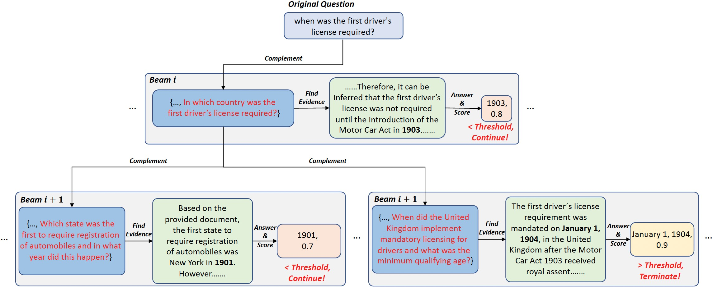

# ALLIES

The code for our paper ALLIES: Prompting Large Language Model with Beam Search.


## Dataset

### NQ

dataset/nq-test.jsonl

### TriviaQA

dataset/tqa-test.jsonl

### WebQ

dataset/webq-test.jsonl

## Run

### Directly Answer

```
python main.py --dataset $dataset --task answer_without_retrieval  --apikey $ID
```

### Answer with retrieval

```
python main.py --dataset $dataset --task answer_with_retrieval --topK $retrieval_num  --apikey $ID
```

### GenRead

```
python main.py --dataset $dataset --task genread --apikey $ID
```

### Allies

```
##GENREAD
python main.py --dataset $dataset --task ALLIES --retrieval_type generate --beam_size $beam_size --beam_Depth $beam_depth --ask_question_num $ask_question_num --apikey $ID

##Retrieval
python main.py --dataset $dataset --task ALLIES --topK $retrieval_num --retrieval_type retrieve --beam_size $beam_size --beam_Depth $beam_depth --ask_question_num $ask_question_num --apikey $ID
```

## Parameters

- $dataset: Dataset for testing
- $ID: The key for API
- $beam_size: Beam size
- $beam_depth: Beam depth
- $ask_question_num: Ask question number
- $retrieval_num: Retrieval doc num
