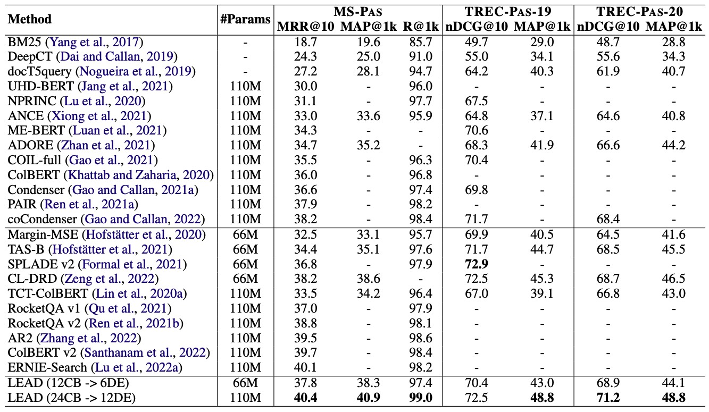

# LEAD

The code for our paper [LEAD: Liberal Feature-based Distillation for Dense Retrieval](https://arxiv.org/abs/2212.05225).


## Overview

Our proposed method LEAD aligns the layer features of student and teacher, emphasizing more on the informative layers by re-weighting.

Here we show the main results on [MS MARCO](https://microsoft.github.io/msmarco/). This method outperformes all the baselines.




## Released Resources

We release the preprocessed data and trained ckpts in [Azure Blob](https://msranlciropen.blob.core.windows.net/simxns/LEAD/).
Here we also provide the file list under this URL:
<details>
<summary><b>Click here to see the file list.</b></summary>
<pre><code>INFO: ckpt/24_to_12_msdoc.ckpt;  Content Length: 1.22 GiB
INFO: ckpt/24_to_12_mspas.ckpt;  Content Length: 1.22 GiB
INFO: ckpt/24_to_12_trec_doc_19.ckpt;  Content Length: 1.22 GiB
INFO: ckpt/24_to_12_trec_doc_20.ckpt;  Content Length: 1.22 GiB
INFO: ckpt/24_to_12_trec_pas_19.ckpt;  Content Length: 1.22 GiB
INFO: ckpt/24_to_12_trec_pas_20.ckpt;  Content Length: 1.22 GiB
INFO: dataset/mspas/biencoder-mspas-train-hard.json;  Content Length: 1.56 GiB
INFO: dataset/mspas/biencoder-mspas-train.json;  Content Length: 5.35 GiB
INFO: dataset/mspas/mspas-test.qa.csv;  Content Length: 319.98 KiB
INFO: dataset/mspas/psgs_w100.tsv;  Content Length: 3.06 GiB
INFO: dataset/mspas/trec2019-test.qa.csv;  Content Length: 99.72 KiB
INFO: dataset/mspas/trec2019-test.rating.csv;  Content Length: 46.67 KiB
INFO: dataset/mspas/trec2020-test.qa.csv;  Content Length: 122.86 KiB
INFO: dataset/mspas/trec2020-test.rating.csv;  Content Length: 57.48 KiB
INFO: dataset/msdoc/biencoder-msdoc-train-hard.json;  Content Length: 800.13 MiB
INFO: dataset/msdoc/biencoder-msdoc-train.json;  Content Length: 294.04 MiB
INFO: dataset/msdoc/msdoc-test.qa.csv;  Content Length: 232.16 KiB
INFO: dataset/msdoc/psgs_w100.tsv;  Content Length: 21.11 GiB
INFO: dataset/msdoc/trec2019-test.qa.csv;  Content Length: 170.55 KiB
INFO: dataset/msdoc/trec2019-test.rating.csv;  Content Length: 80.84 KiB
INFO: dataset/msdoc/trec2020-test.qa.csv;  Content Length: 96.26 KiB
INFO: dataset/msdoc/trec2020-test.rating.csv;  Content Length: 46.04 KiB</code></pre>
</details>

To download the files, please refer to [HOW_TO_DOWNLOAD](https://github.com/microsoft/SimXNS/tree/main/HOW_TO_DOWNLOAD.md).


## Environments Setting

We implement our approach based on Pytorch and Huggingface Transformers. We list our command to prepare the experimental environment as follows:

```
yes | conda create -n lead
conda init bash
source ~/.bashrc
conda activate lead
conda install -y pytorch==1.11.0 cudatoolkit=11.5 faiss-gpu -c pytorch
conda install -y pandas
pip install transformers
pip install tqdm
pip install wandb
pip install sklearn
pip install pytrec-eval
```

## Dataset Preprocess

We conduct experiments on MS-PAS and MS-DOC datasets. You can download and preprocess data by using our code:

```
cd data_preprocess
bash get_data.sh
```

## Hard Negative Generation

The negatives in the original dataset are mainly random or BM25 negatives. Before training, we first train a 12-layer DE and get top-100 hard negatives.

```
cd hard_negative_generation
bash train_de.sh $DATASET $MASTER_PORT $MAX_DOC_LENGTH $MAX_QUERY_LENGTH $TRAIN_BATCH_SIZE $NUM_NEGATIVES
bash retrieve_hard_negatives_academic.sh $DATASET $MASTER_PORT $MODEL_PATH $CKPT_NAME $MAX_DOC_LENGTH $MAX_QUERY_LENGTH
```

## Single Model Training

Before distillation, we train the teacher and student with the mined hard negatives as warming up. You can go to the warm_up directory and run the following command:

### Train a 6-layer Dual Encoder

```
bash train_6_layer_de.sh $DATASET $MASTER_PORT $MAX_DOC_LENGTH $MAX_QUERY_LENGTH $TRAIN_BATCH_SIZE $NUM_NEGATIVES
```

### Train a 12-layer Dual Encoder

```
bash train_12_layer_de.sh $DATASET $MASTER_PORT $MAX_DOC_LENGTH $MAX_QUERY_LENGTH $TRAIN_BATCH_SIZE $NUM_NEGATIVES
```

### Train a 12-layer ColBERT

```
bash train_12_layer_col.sh $DATASET $MASTER_PORT $MAX_DOC_LENGTH $MAX_QUERY_LENGTH $TRAIN_BATCH_SIZE $NUM_NEGATIVES
```

### Train a 12-layer Cross Encoder

```
bash train_12_layer_ce.sh $DATASET $MASTER_PORT $MAX_DOC_LENGTH $MAX_QUERY_LENGTH $TRAIN_BATCH_SIZE $NUM_NEGATIVES
```

### Train a 24-layer ColBERT

```
bash train_24_layer_col.sh $DATASET $MASTER_PORT $MAX_DOC_LENGTH $MAX_QUERY_LENGTH $TRAIN_BATCH_SIZE $NUM_NEGATIVES
```

## LEAD distillation

### Distill from 12-layer DE to 6-layer DE

```
bash distill_from_12de_to_6de.sh $DATASET $MASTER_PORT $DISTILL_LAYER_NUM $MAX_DOC_LENGTH $MAX_QUERY_LENGTH $TRAIN_BATCH_SIZE $NUM_NEGATIVES $WARM_RATIO $DE_MODEL_PATH $DB_MODEL_PATH
```

### Distill from 12-layer CB to 6-layer DE

```
bash distill_from_12cb_to_6de.sh $DATASET $MASTER_PORT $DISTILL_LAYER_NUM $MAX_DOC_LENGTH $MAX_QUERY_LENGTH $TRAIN_BATCH_SIZE $NUM_NEGATIVES $WARM_RATIO $CB_MODEL_PATH $DB_MODEL_PATH
```

### Distill from 12-layer CE to 6-layer DE

```
bash distill_from_12ce_to_6de.sh $DATASET $MASTER_PORT $DISTILL_LAYER_NUM $MAX_DOC_LENGTH $MAX_QUERY_LENGTH $TRAIN_BATCH_SIZE $NUM_NEGATIVES $WARM_RATIO $CE_MODEL_PATH $DB_MODEL_PATH
```

### Distill from 24-layer CB to 12-layer DE

```
bash distill_from_24cb_to_12de.sh $DATASET $MASTER_PORT $DISTILL_LAYER_NUM $MAX_DOC_LENGTH $MAX_QUERY_LENGTH $TRAIN_BATCH_SIZE $NUM_NEGATIVES $WARM_RATIO $CB_MODEL_PATH $DB_MODEL_PATH
```

## Inference

### Inference 6-layer DE

```
bash evaluate_6_layer_de.sh $DATASET $MASTER_PORT $MODEL_PATH $FIRST_STEPS  $EVAL_STEPS $MAX_STEPS $MAX_DOC_LENGTH $MAX_QUERY_LENGTH
```

### Inference 12-layer DE

```
bash evaluate_12_layer_de.sh $DATASET $MASTER_PORT $MODEL_PATH $FIRST_STEPS  $EVAL_STEPS $MAX_STEPS $MAX_DOC_LENGTH $MAX_QUERY_LENGTH
```

## Parameters
The meaning of each parameter is defined as follows. For detailed initialization of these parameters, please refer to Section ''Hyper-parameter and Initialization'''  in Appendix B of our paper.
- `--DATASET`: The dataset used for training, e.g, mspas or msdoc.
- `--MASTER_PORT`: The master port for parallel training, e.g., 3000.
- `--FIRST_STEPS`: The first evaluation step.
- `--EVAL_STEPS`: The evaluation step gap.
- `--MAX_STEPS`: The maximum evaluation step.
- `--WARM_RATIO`: The warm up ratio of the training.
- `--MAX_DOC_LENGTH`: The maximum input length for each document.
- `--MAX_QUERY_LENGTH`: The maximum input length for each query.
- `--TRAIN_BATCH_SIZE`: Batch size per GPU.
- `--NUM_NEGATIVES`: The number of negatives for each query.
- `--DISTILL_LAYER_NUM`: The number of layers for distillation.
- `--MODEL_PATH`: The directory name of saved checkpoint.
- `--DE_MODEL_PATH`: The path of DE teacher checkpoint.
- `--CB_MODEL_PATH`: The path of CB teacher checkpoint.
- `--CE_MODEL_PATH`: The path of CE teacher checkpoint.
- `--DB_MODEL_PATH`: The path of DE student checkpoint.
- `--CKPT_NAME`: The training step of the checkpoint

## 📜 Citation

Please cite our paper if you use [LEAD](https://arxiv.org/abs/2212.05225) in your work:
```bibtex
@article{sun2022lead,
  title={LEAD: Liberal Feature-based Distillation for Dense Retrieval},
  author={Sun, Hao and Liu, Xiao and Gong, Yeyun and Dong, Anlei and Jiao, Jian and Lu, Jingwen and Zhang, Yan and Jiang, Daxin and Yang, Linjun and Majumder, Rangan and others},
  journal={arXiv preprint arXiv:2212.05225},
  year={2022}
}
```
