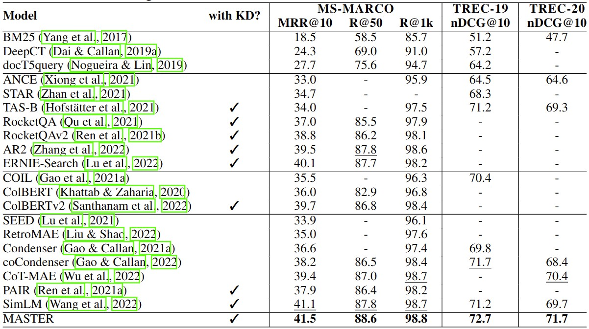

# MASTER

The code of the ICLR2023 submission [***MASTER: Multi-task Pre-trained Bottlenecked Masked Autoencoders are Better Dense Retrievers***](https://arxiv.org/abs/2212.07841).


## 🚀 Overview
Our code is based on the public released code of [Condenser](https://github.com/luyug/Condenser). Our proposed approach incorporates three types of pre-training tasks, namely corrupted passages recovering, related passage recovering and PLMs outputs recovering, and unifies and integrates the above pre-training tasks with different learning objectives under the bottlenecked masked autoencoder architecture. 

Here we show the main results on [MS MARCO](https://microsoft.github.io/msmarco/). This method outperformes the state-of-the-art pretraining methods.


Please find more details in the paper.

## ⚙️ Environments Setting
We implement our approach based on Pytorch and Huggingface Transformers. For efficiently training, we also require the public toolkit fp16 for acceleration. We list the detailed environment setting command lines as follows:

```
conda install pytorch==1.7.1 cudatoolkit=11.0 -c pytorch
conda install faiss-gpu cudatoolkit=11.0 -c pytorch
conda install transformers
pip install tqdm
pip install tensorboardX
pip install lmdb
pip install datasets
pip install wandb
pip install boto3
pip install h5py
pip install numba
git clone https://github.com/ptrblck/apex.git
cd apex
pip install -v --disable-pip-version-check --no-cache-dir --global-option="--cpp_ext" --global-option="--cuda_ext" ./
```


## 🙋 Pre-training
We publicly release our data and code for re-implementation our pre-training process.

### Pre-training Corpus
We utilize the documents from the MS-MARCO passage retrieval and the Natural Questions tasks for pre-training the parameters of two models, respectively. Then, the two pre-trained models will be used for fine-tuning on the corresponding two tasks.

To construct our pre-training corpus, we first tokenize the given documents and convert them into their token ids using BertTokenizer. As our approach requires the outputs of the publicly released GPT-2 and DocT5, we leverage the two models to generate the texts, and also pre-process these texts into token ids. Here, we show an example as following:
```
{"text": [1037, 1011, 5968, 102, 1999, 2238, 3758, 1010, 1996, 2142, 2163, 2390, 3650, 1997, 6145, 4783, 5289, 1996, 7128, 2622, 1011, 1996, 3595, 2171, 2005, 1996, 1016, 9593, 9767, 1012], 
 "queries": [[2043, 2020, 1996, 2048, 9593, 9767, 3603], [2043, 2106, 7128, 2622, 2707], [2339, 2001, 7128, 8647], [2043, 2106, 1996, 7128, 5968, 15044], [2043, 2106, 1996, 7128, 2622, 4148, 1998, 2339], [2054, 2001, 1996, 2171, 1997, 1996, 2034, 9593, 5968], [2054, 2095, 2020, 1996, 1016, 9593, 9767, 2081], [2029, 2095, 2001, 1996, 7128, 2622, 5625], [2043, 2106, 7128, 2622, 2707], [2339, 2106, 1996, 7128, 2622, 4148]], 
 "next": [[2023, 3720, 2003, 2055, 1037, 2839, 1999, 3565, 15132, 10243, 1012, 7209, 1012, 2005, 1996, 2839, 1999, 3565, 15132, 10243, 1012, 23244, 1010, 2156, 20481, 2232, 1012, 20481, 2232, 2003, 1037, 2839, 1999, 7209, 1012, 2010, 2171, 2003, 1037, 8386, 2006, 1996, 2446, 2773, 1000, 22822, 4181, 1000, 1010, 1996, 3763, 7117, 2965, 1000, 1996, 2598, 1000, 1998, 1996, 2394, 8349, 1010, 2013, 1000, 9388, 1000, 1010, 2965, 1000, 9587, 2860, 1000, 1010, 2029, 16315, 2000, 1000, 9587, 2860, 1037, 2492, 1000, 1012, 20481, 2232, 2003, 1996, 4602, 6750, 1999, 2381, 1010, 1998, 2003, 2036, 2028, 1997, 2049, 2087, 9480, 2372, 1012, 2000, 2023, 2203, 1010, 2002, 1005, 1055, 4703, 1996, 2028, 26974, 1996, 4690, 1012, 1999, 15132, 1018, 1010, 20481, 2232, 3084, 2010, 2034, 3311, 1998, 2034, 16854, 3410]]}
```
where "text" denotes the proprecessed documents, "queries" is the list consisting of the generated queries from DocT5, "next" is the generated following text by GPT-2. For the convenience of researchers to use them, we upload the pre-processed documents from MS-MARCO and Wikipedia as following:

|Corpus|Description|Link|
|---|---|---|
|MS-MARCO|Processed Documents for MS-MARCO passage retrieval task|https://uswvhd.blob.core.windows.net/anonymous/MASTER/ms_pass4M5.tsv.json|
|Wikipedia|Processed Documents for NQ, TQ, WQ and Squad datasets|https://uswvhd.blob.core.windows.net/anonymous/MASTER/wiki_psg_w1004MT5.tsv.json|

After download the above data, researchers can remove them into the **process_data** dir for usage.

### Generating the frequency dictionary
For the Masked Keywords Prediction task, we require to calculate the word frequencies to detect the keywords. In the following, we provide the code to construct the dictionary consisting of the word and its frequency in the corpus:
```python
import os
import json
from tqdm import tqdm
from transformers import BertTokenizer
data_dir = 'process_data_MS_doc'
data_files = os.listdir(data_dir)
tokenizer = BertTokenizer.from_pretrained('bert-base-uncased')
special_tokens = set(tokenizer.all_special_tokens)
frequency_dict = {}
for file in data_files:
    file_name = os.path.join(data_dir, file)
    f = open(file_name)
    print('processing, ', file_name)
    for line in tqdm(f):
        input_line = json.loads(line.strip())['text']
        input_tokens = tokenizer.convert_ids_to_tokens(input_line)
        merged_tokens = []
        for token in input_tokens:
            if token in special_tokens:
                continue
            if token.startswith("##"):
                merged_tokens[-1] += token
            else:
                merged_tokens.append(token)
        for merged_token in merged_tokens:
            frequency_dict[merged_token] = frequency_dict.get(merged_token, 0) + 1
json.dump(frequency_dict, open('frequency_dict_MS_doc.json','w', encoding='utf-8'), ensure_ascii=False)
```

### Pre-training using our Code
Based on the pre-processed pre-training corpus and the word frequency dictionary, you can just run the following command for pre-training using our code:
```
bash run_pretrain.sh
```

* `--output_dir`: The local dir for saving the pre-trained checkpoints of our approach.
* `--model_name_or_path`: Pre-trained checkpoints for initialization. We support BERT-based models (`bert-base-uncased`, `bert-large-uncased`).
* `--save_steps`: We save the pre-trained checkpoints after the number of steps.
* `--per_device_train_batch_size`: Batch size per GPU.
* `--gradient_accumulation_steps`: The steps for gradient accumulation.
* `--warmup_ratio`: The ratio of warmup steps during training.
* `--learning_rate`: The peak learning rate during training.
* `--num_train_epochs`: The number of pre-training epoches.
* `--n_head_layers`: The number of the shallow decoders' layers.
* `--max_seq_length`: The maximum sentence length for input text.
* `--train_dir`: The dir that stores the pre-training corpus.
* `--frequency_dict`: The dictionary that records the word frequencies calculated from the pre-training corpus. It will be used for the Masked Keywords Prediction task.
* `--fp16`: using fp16 for training acceleration.

## ⚽ Fine-tuning
Here, we also provide the compressed pre-trained checkpoints of our approach on the MS-MARCO and Wikipedia documents as following:

|Corpus|Description|Link|
|---|---|---|
|MS-MARCO|Pre-trained Checkpoint for MS-MARCO task|https://uswvhd.blob.core.windows.net/anonymous/MASTER/MASTER-MARCO.tar.gz|
|Wikipedia|Pre-trained Checkpoint for NQ, TQ, WQ and Squad tasks|https://uswvhd.blob.core.windows.net/anonymous/MASTER/MASTER-Wiki.tar.gz|


All the checkpoints are compressed into the tar.gz format, everyone can use them by the following command line to obtain our pre-training corpus.
```
mkdir MASTER-MARCO
cd MASTER-MARCO
tar -zxvf MASTER-MARCO.tar.gz
```
As our pre-trained model parameters are stored using the same format as BERT, everyone can directly load it using huggingface interface and freely fine-tuned. Here, we show an example to load our pre-trained checkpoint.
```python
from transformers import AutoModel
model = AutoModel.from_pretrained('MASTER-MARCO')
```
During fine-tuning, the parameters of our pre-trained shallow decoders will be omitted, and only the parameters from the deep encoder will be used. We suggest to use the public released toolkit [Tevatron](https://github.com/texttron/tevatron/tree/main/examples/coCondenser-marco) to reproduce our experimental results.


## 📜 Citation

Please cite our paper if you use [MASTER](https://arxiv.org/abs/2212.07841) in your work:
```bibtex
@article{zhou2022master,
   title={MASTER: Multi-task Pre-trained Bottlenecked Masked Autoencoders are Better Dense Retrievers},
   author={Kun Zhou, Xiao Liu, Yeyun Gong, Wayne Xin Zhao, Daxin Jiang, Nan Duan, Ji-Rong Wen},
   booktitle = {{arXiv}},
   year={2022}
}
```